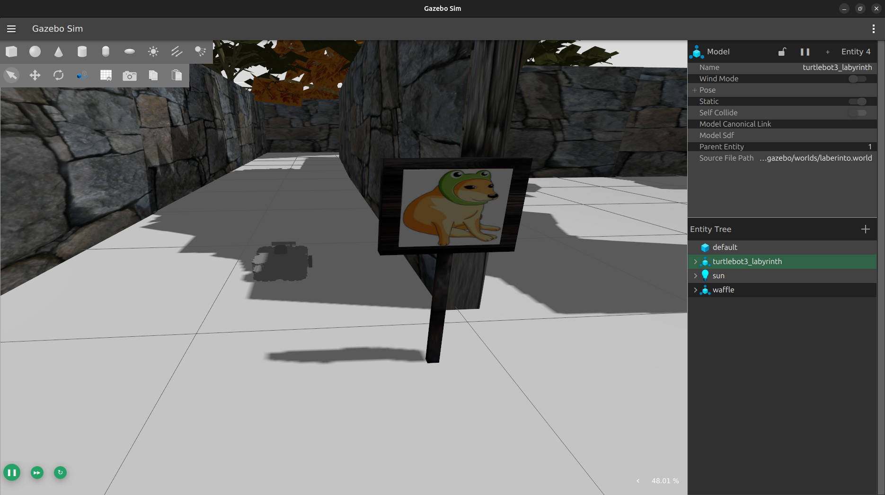

# 🧭 MazeNavBot

This project was developed to demonstrate basic knowledge of **ROS 2 Jazzy**.  
It consists of a simple maze-like world built in **Gazebo Harmonic**, where a **TurtleBot3** navigates autonomously using a **LiDAR sensor**. The robot moves forward, detecting walls and navigating the environment based on the sensor data.

<p align="center">
  
</p>

## 🧪 Technologies Used
- ROS 2 Jazzy
- Gazebo Harmonic
- TurtleBot3
- LiDAR Sensor
- Python (control nodes)

## 🚀 Features
The robot:
- Detects walls using the LiDAR sensor.
- Follows walls 
- Navigates through a maze-like environment.

---

# **How to Run the Program**  

## **Prerequisites**  

You need to install the TurtleBot3 packages in order to use the TurtleBot in Gazebo:
- [TurtleBot3 Quick Start Guide](https://emanual.robotis.com/docs/en/platform/turtlebot3/quick-start/)

> **Note:**  
> The custom world used in this project is located inside the `turtlebot3_simulations` package.  
> It is necessary to download this package, included in this repository in order to run the simulation properly.

### Setup Instructions  

1. **Download the source code** and place it inside a ROS workspace.
2. **Compile the workspace** by running:  

    ```bash
    colcon build
    ```
3. **Run the program** with the following commands:  

    ```bash
    source /opt/ros/jazzy/setup.bash
    source install/setup.bash
    export TURTLEBOT3_MODEL=waffle
    ros2 launch turtlebot3_gazebo robot_laberinto.launch.py
    ```  

4. **In another terminal**, before starting the wall-following behavior, it is necessary to make the robot perform a rotation so that it can detect the closest wall and begin navigation properly.

    ```bash
    source /opt/ros/jazzy/setup.bash
    source install/setup.bash
    ros2 run move_scan wall_server
    ```
    
5. Third terminal
    ```bash
    source /opt/ros/jazzy/setup.bash
    source install/setup.bash
    ros2 service call /find_wall service_pkg/srv/FindWall {}
    ```
  Result

  Once this first task is completed, close the program running in step 4.
